**Ноутбуки, в которых EDA выполнялся членами команды, находятся в отдельных ветках репозитория AIYP24-Calorie-Tracker.**

### Краткая версия EDA с выводами

Всего категорий — 256.

Топ-10 категорий с наибольшим количеством изображений:

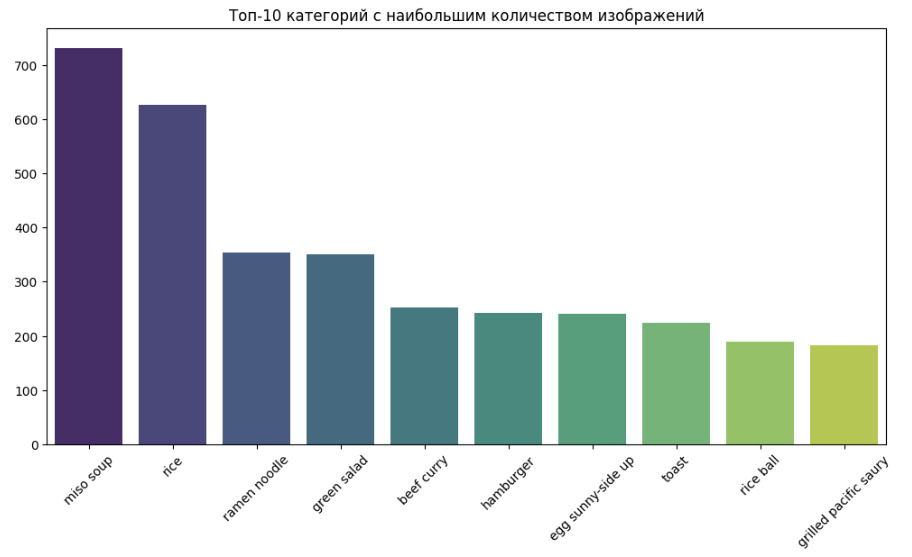

Ключевой вывод: Самая популярная категория - мисо-суп

Топ-10 категорий с наименьшим количеством изображений:

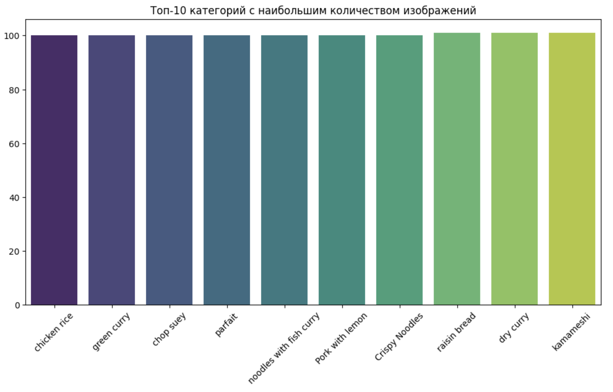

Ключевой вывод: Минимальное кол-во изображений в рамках одной категории: 100

Визуальная оценка распределения изображений по всем 256 категориям:

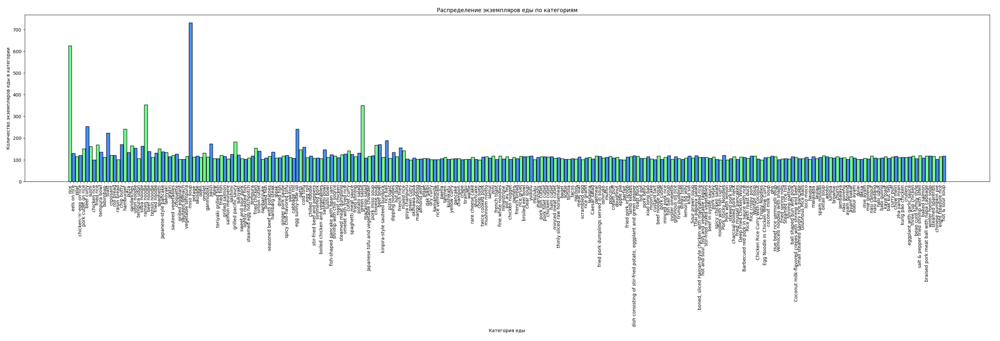

Визуализация нескольких случайных изображений:

Визуализация bounding boxes:

Ключевой вывод: bounding boxes отрисовываются в целом адекватно

Плотность расположения объектов на изображениях:

Ключевой вывод: Видим, что чаще всего еда расположена ближе к центру снимка.

Распределение площадей объектов в bounding box:

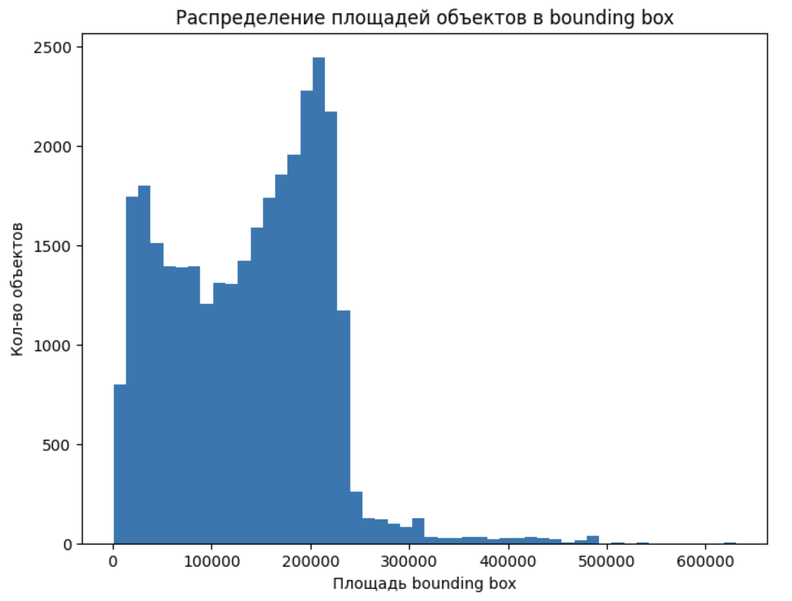

Визуальная оценка распределения площадей bounding box по всем 256 категориям:

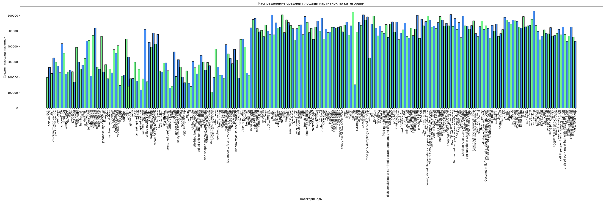

Ключевой вывод: Видим ненормальное распределение площадей баундинг боксов. Есть изображения с несколькими баундинг боксами.

Результат группировки 256 видов блюд по основным продуктам:

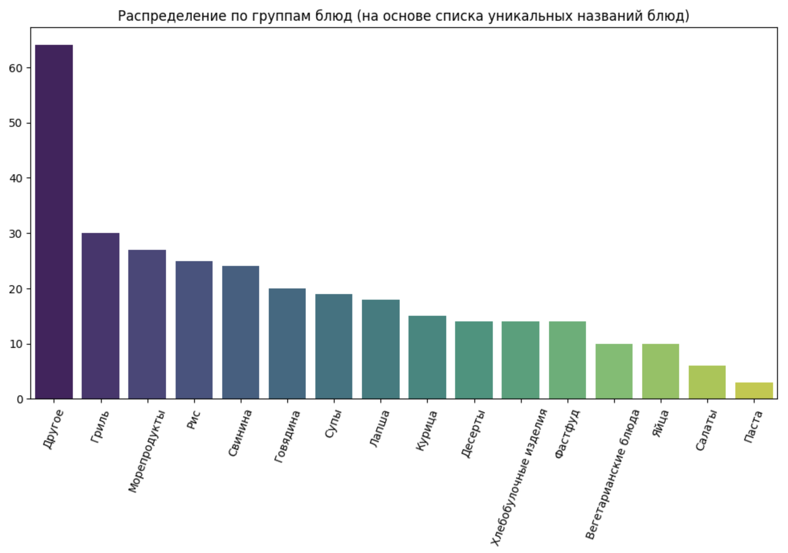

Общее количество картинок в датасете по основным продуктам:

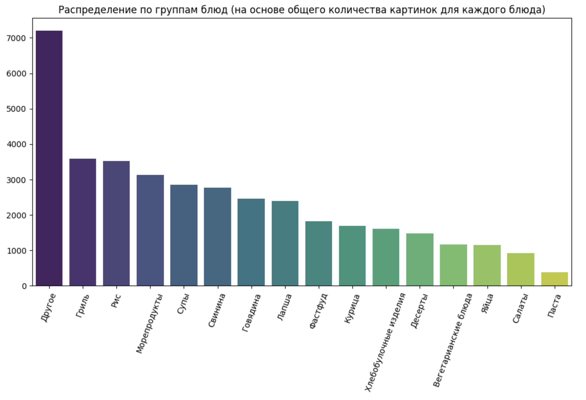

Ключевой вывод: больше всего картинок приходится на гриль, рис и морепродукты.

Блюда, для которых на одном изображении может присутствовать более одного экземляра.

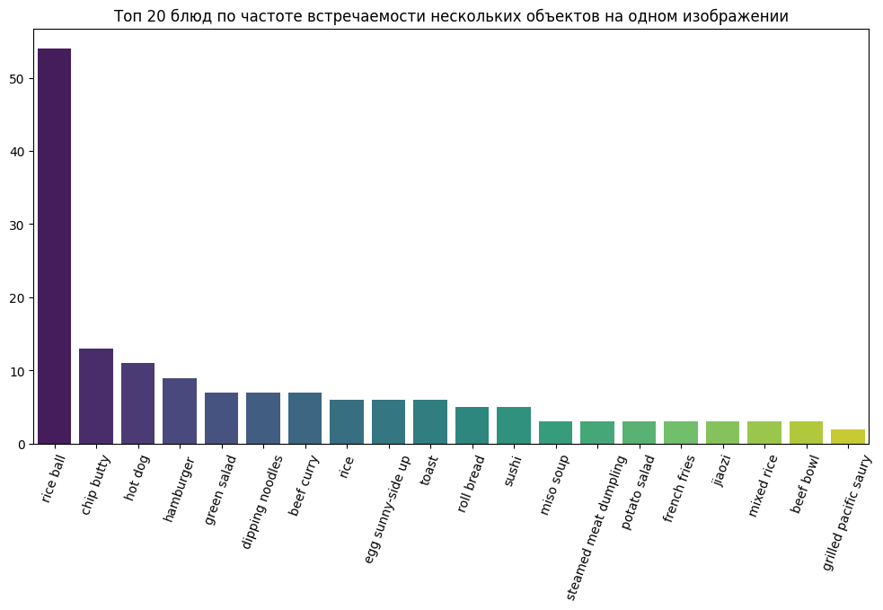

Ключевой вывод: в датасете довольно мало изображений с количеством экземпляров одного класса большим 1го относительно общего количества изображений.

В датасете присутствуют ошибки. Одна картинка с одним и тем же названием может относиться к двум разным классам и быть корретктно размеченной.

Однако, возможны случаи когда разные изображения имеют одно и то же название.

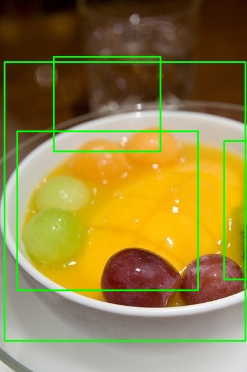

Ключевой вывод: названия могут совпадать в разных классах как для дублирующихся картинок, так и не для дублирующихся. Из-за подобного возникает путаница в сопоставлении разметки и изображений, названия которых повторяются в папках для разных классов. Возможным решением является попиксельное сравнение изображений, называющихся одинаково. Если новое изображение аналогично, встреченному ранее с тем же названием, то на него добавляются новые боксы, в противном случае встреченное изображение переименовывается, чтобы не возникало путаницы.

Также присутствует определенная несогласованность в разметке.

Хороший пример.

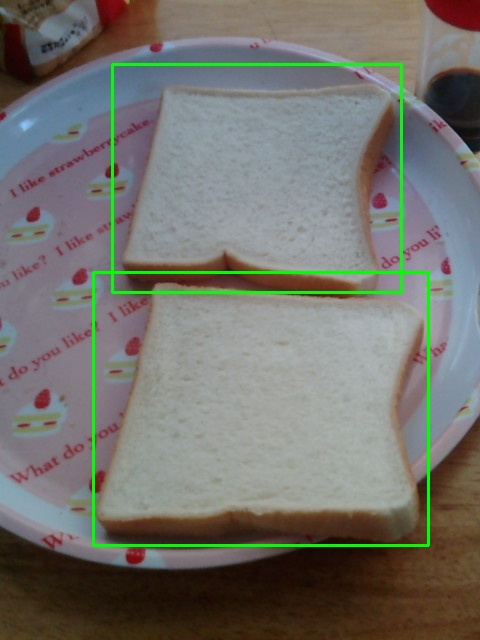

Плохой пример.

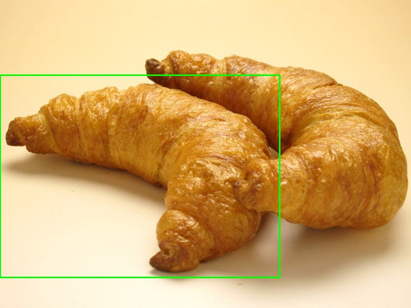

Ключевой вывод: несогласованность подхода к разметке внутри датасета может напрямую влиять на финальное качество обученной модели на данном наборе данных.